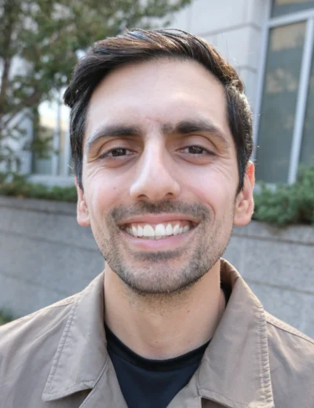

```{=html}
<div class="about-hero">
  <div class="about-photo">
    
    <div class="about-links">
      <a href="https://linkedin.com/in/azaidi06/" title="LinkedIn"><i class="bi bi-linkedin"></i></a>
      <a href="https://github.com/azaidi06" title="GitHub"><i class="bi bi-github"></i></a>
      <a href="https://x.com/aloysious_zaidi" title="Twitter/X"><i class="bi bi-twitter-x"></i></a>
      <a href="mailto:azaidi06@gmail.com" title="Email"><i class="bi bi-envelope"></i></a>
    </div>
  </div>
  <div class="about-text">
    <p class="about-lead"><strong>Product leader · applied data scientist</strong></p>
    <p>I bridge product vision and production ML &mdash; from defining roadmaps and architecting pipelines, to shipping features that hold up at scale. Previously at Lawrence Berkeley National Laboratory; currently cofounding a computer-vision-for-golf startup.</p>
  </div>
</div>

<section class="about-prose">

<h2>Background</h2>

<p>I started in pharmaceutics &mdash; managing FDA submissions and regulatory operations &mdash; before pivoting hard into engineering. Six years on, I&rsquo;m comfortable across the stack: from training transformers on multi-node SLURM clusters at LBNL, to standing up cost-optimized inference pipelines on AWS, to writing the occasional tennis-data essay.</p>

<p>The constant has been wanting to ship work that compounds: tools that other people use, papers that get cited, and analyses that change how someone thinks about a problem.</p>

<h2 class="meta-eyebrow">At a glance</h2>
<ul>
  <li>Currently</li><li>Cofounder & Head of Data Science, EagleSwing</li>
  <li>Previously</li><li>Computer Systems Engineer II, Lawrence Berkeley National Lab</li>
  <li>Living</li><li>Berkeley, CA</li>
  <li>Working in</li><li>Python · PyTorch · CUDA · AWS · SLURM · Plotly · Quarto</li>
  <li>Interested in</li><li>Computer vision, applied LLMs, sports analytics, instrumented decision-making</li>
  <li>Open to</li><li>Interesting collaborations and conversations &mdash; <a href="mailto:azaidi06@gmail.com">say hi</a></li>
</ul>

<h2>How I work</h2>

<p>Strong opinions, weakly held. I prefer scrappy first prototypes over architecture diagrams, and I will fight for the simplest thing that could possibly work. The right tool is the one your team can maintain in eighteen months.</p>

<p>I read papers in the morning and instrument production at night. The two halves keep each other honest.</p>

</section>
```
